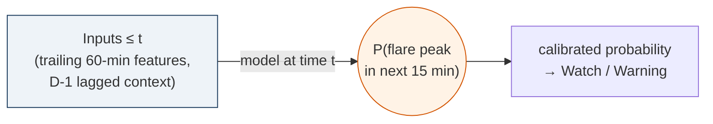
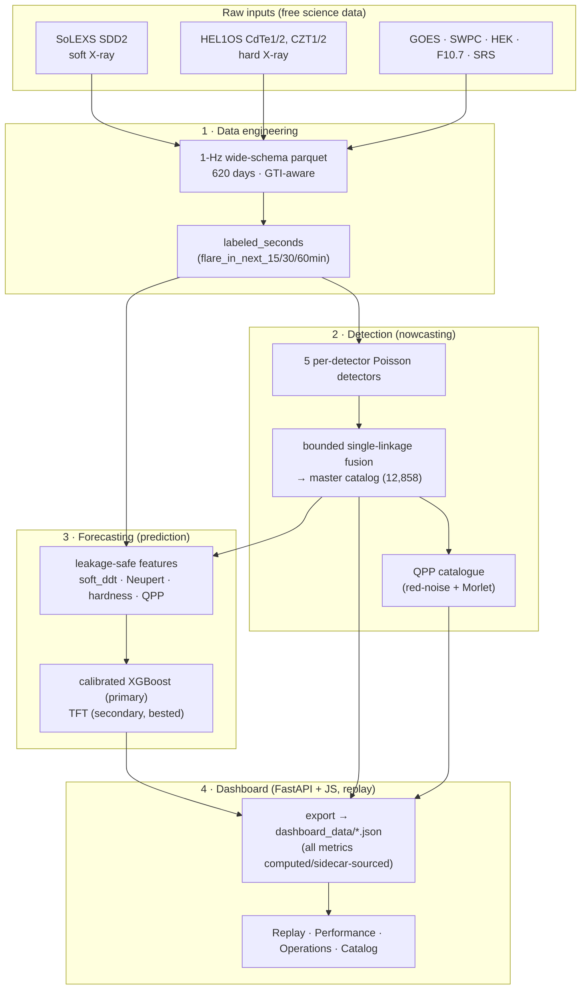

# Submission Notes — Aditya-L1 Solar Flare System (PS-15)

*Authoritative, judge-facing definitions, diagrams, and claim language. Every number here is reproduced from the pipeline's evaluation files (`data/processed/reports/`) — see provenance notes per section. This document operationalises the final-review checklist.*

---

## 0. Data integrity (checklist #1) — DONE

Every metric shown in the dashboard is now **computed at export time** (forecasting numbers, from the trained model + its test predictions) or **read from a stage's machine-readable sidecar** (detection: `13_evaluate.py` → `detection_metrics.json` and `gate3_evaluate.py` → `hardness_ordering.json`; TFT: `17_train_tft.py` → `tft_metrics.json`). No performance number is hand-entered in `export_dashboard_data.py` or `performance.js`. A judge can open the sidecar JSON (or the matching `.txt` report) and see the exact value the dashboard displays.

---

## 1. The forecast, defined once (checklist #2, #11)

The forecasting label `flare_in_next_15min` is set to 1 over the interval `[peak − 15 min, peak)` for every catalogued flare peak (`src/data/labeling.py`). Therefore the **single, exact definition** — used everywhere — is:

> **Using only observations available at time `t` (features computed from `t` and earlier), estimate the probability that a flare will _peak_ within the next 15 minutes, i.e. in `(t, t + 15 min]`.**

We say **"peak within 15 minutes"**, not "begin within 15 minutes", because the labels are genuinely keyed to flare **peak** time. The same applies to the 30- and 60-minute horizons.

### Causal forecast timeline

```
   features computed here              what we predict
   (trailing windows, ≤ t)            (strictly future)
 ┌───────────────────────────┐   t   ┌────────────────────────┐
 │  [t − 60 min … t]          │──────▶│  (t , t + 15 min]      │
 │  detector rates, soft_ddt, │       │  does a flare PEAK     │
 │  hardness, Neupert resid,  │       │  in this window?       │
 │  event history, QPP, D-1   │       │  → calibrated P(flare) │
 │  context (lagged 1 day)    │       └────────────────────────┘
 └───────────────────────────┘
        PAST / KNOWN                          FUTURE / UNKNOWN
```



This is **forecasting** (the target is strictly in the future), not detection of a flare already in progress. Lead time is bounded at 15 min by construction (honest: the model is a 15-min forecaster).

---

## 2. Nowcasting vs Forecasting — never conflated (checklist #4)

These are **two different tasks** with two different numbers. Keep them in separate boxes; never place the 0.84 next to "15-minute forecasting".

| | **NOWCASTING (detection)** | **FORECASTING (prediction)** |
|---|---|---|
| Question | Is a flare occurring **now**? | Will a flare **peak in the next 15 min**? |
| Inputs vs target | concurrent | strictly future (causal) |
| Headline | **TSS 0.84** (event, catalog-aware) / 0.746 (per-bin nowcast) | **TSS 0.346** (15-min) |
| Recall / skill | master event POD **0.872** (> best single detector 0.808) | POD 0.57, FAR 0.80, precision 0.20 |
| Baselines beaten | persistence 0.007, climatology 0.000 | persistence 0.162, climatology 0.000, TFT 0.235 |

*Provenance: `detection_metrics.txt` / `detection_metrics.json` (nowcasting); `forecasting_metrics.txt` / `summary_metrics.json` (forecasting).*

---

## 3. X-class denominator reconciliation (checklist #3)

The different X-class figures are **all correct for different subsets**. One table removes any appearance of contradiction. *(Source: `flares_swpc.parquet` over the 620 built days; `master_catalog_eval.txt`; `forecasting_metrics.txt`.)*

| Evaluation group | Total X events | Instrument-observed (in-GTI) | Correctly detected / forecast |
|---|---:|---:|---:|
| **Detection** — all 620 built days | 49 | 43 | **43 (100%)** detected |
| **Forecasting** — chronological test (2026-01-01 … 06-13) | 11 | 8 | **8** forecast (≥ Watch, in pre-peak window) |
| **Forecasting** — quiet→X subset (test) | 2 | 2 | **2** flagged ~15 min ahead |

Notes:
- 85 X-flares exist in the SWPC catalogue overall; 52 fall in our calendar range; **49** land on days we actually built; **43** of those were in-GTI (instrument-observed) and **all 43 were detected**.
- In the forecast test, of 11 X-flares, **3 had no in-GTI feature rows** in `[peak−15min, peak]` (instrument coverage gaps, not model misses) → of the **8 observed**, **8 were forecast (8/8)**.

### Claim language
- ✅ "The nowcasting detector identified **all 43 of the 43 instrument-observed X-class events**."
- ✅ "In held-out forecasting, **8/8 instrument-observed test X-flares** were flagged before peak (8/11 of all test X-flares; 3 had no coverage)."
- ❌ Do **not** say "100% X-class prediction." Detection ≠ prediction.

---

## 4. Calibration provenance (checklist #5)

The ECE improvement is genuine and the split is clean (`scripts/18_calibrate_evaluate.py`):

1. Isotonic regression is **fit on the validation period only** (2025-07-01 … 2025-12-31).
2. ECE / Brier are reported on the **untouched test period** (2026-01-01 … 2026-06-13), disjoint from validation.
3. Model selection (XGBoost early stopping, threshold tuning) uses **validation**, never test.
4. Isotonic is monotonic → **ranking (TSS) is preserved**; only reliability changes.

**Test-set, 15-min:** ECE **0.340 → 0.006**, Brier **0.194 → 0.070**, TSS 0.346 (unchanged). Reliability bins and sample sizes: 10 equal-width bins, test N = 210,253 in-GTI rows. *(Source: `forecasting_metrics.txt`, `summary_metrics.json`.)*

> Approved wording: "Isotonic calibration reduced **test-set** ECE from 0.340 to 0.006 (Brier 0.194 → 0.070); fit on validation, evaluated on the held-out test period."

---

## 5. QPP catalogue framing (checklist #7)

*(Source: `qpp_catalog.parquet`.)* Distinguish **candidates** (individual significant detections) from **flare events**, and separate the regimes:

> A systematic Aditya-L1 QPP candidate catalogue: **1,043 candidate detections across 513 flare events.**

| Regime | Candidates | Flare events | Attribution |
|---|---:|---:|---|
| Classic ≥ 16 s | 164 | 119 | robustly solar — **lead with these** |
| Intermediate 8–16 s | 118 | 54 | solar |
| Short 4–8 s | 761 | 340 | **PENDING** instrumental cross-check (Inglis 2011) |

- Lead the scientific analysis with the **classic ≥ 16 s** population and the featured X-class event.
- State explicitly that the **short 4–8 s** signals are statistically real but their **solar attribution is pending** an instrumental cross-check — never claim them as confirmed solar.
- Avoid "world's first" unless a complete literature search supports it; "a systematic Aditya-L1 QPP candidate catalogue" is the safe, accurate phrasing.

---

## 6. System architecture (checklist #10)



**One-line positioning:** *A complete Aditya-L1-native pipeline fusing five soft- and hard-X-ray detector streams: it reliably detects ongoing flares, extracts physically meaningful thermal-to-non-thermal precursors, and issues calibrated probabilities for whether a flare will peak within 15 minutes — every forecast causally validated, compared against same-horizon baselines, and withheld when instrument coverage is insufficient.*

---

## 7. Claims discipline (quick reference)

| Use | Avoid |
|---|---|
| "Detected all 43 instrument-observed X-flares" | "100% X-class prediction" |
| "15-min forecast TSS 0.346, beats same-horizon baselines" | comparing 0.346 to 24-h forecasting scores |
| "Detection TSS 0.84 (nowcasting, separate task)" | placing 0.84 beside "15-min forecasting" |
| "Test-set ECE 0.340→0.006 (fit on val)" | "ECE 0.006" with no split stated |
| "1,043 QPP candidates across 513 events" | "513 QPP events" (conflates candidates/events) |
| "systematic Aditya-L1 QPP candidate catalogue" | "world's first" (unverified) |
| "deployment-ready, demonstrated via causal replay" | "the system is already live" |

*Future work only (not in PS-15): SHARP/magnetogram fusion for 6–24 h forecasting; foundation time-series model; grounded LLM operator briefings; live mission-stream inference. See `DEVELOPMENT_APPROACH.md`.*
